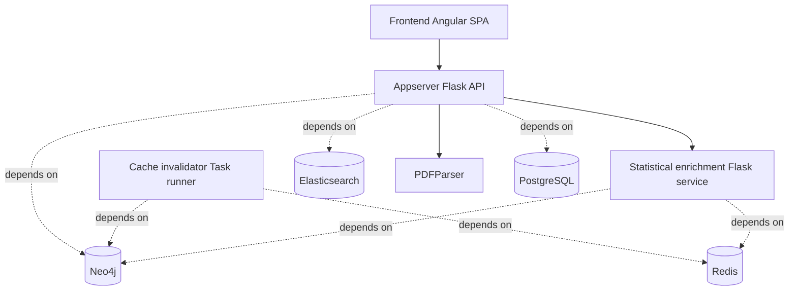

#  Mycelium
*Mycelium* is a high-performance knowledge discovery platform designed to map the intricate networks of biological data. Just as mycelium forms the underlying nervous system of the natural world, this platform unifies disparate datasets into a cohesive, navigable graph architecture—empowering researchers to uncover hidden relationships and accelerate the pace of scientific insight.

[](https://github.com/codespaces/new/Skitionek/mycelium?quickstart=1&devcontainer_path=.devcontainer%2Fdevcontainer.json)

Roadmap:
+ [x] Zero-configuration to start developing
+ [x] Provide alternative tab/panel implementation
+ [ ] Correct sqlachemy models
+ [ ] Reactive file indexing and annotating
+ [ ] Unified tooltips
+ [ ] Angular PDF.js integration
+ [x] Drop jQuery dependency
+ [ ] Observable files (pararrel edits)
+ [x] Add automated tests
+ [x] Automated itegration/deployment

## Comparison with Lifelike

| Feature / Improvement | [SBRG/lifelike](https://github.com/SBRG/lifelike) | Mycelium |
|---|:---:|:---:|
| **Dev environment** | Manual setup required | Zero-config via VS Code Dev Container / GitHub Codespaces |
| **Angular version** | v9 | v14 |
| **Tab/panel implementation** | Custom component | URL-encoded named router outlets (`route-with-dynamic-outlets`) |
| **PDF viewer library** | pdfjs-dist 2.9.359 | pdfjs-dist 4.2.67 (CVE-2024-4367 fixed) |
| **Office file support** | ❌ | ✅ Open and view Office files (`.docx`, `.xlsx`, `.pptx`, `.xls`, `.ppt`, `.odt`, etc.) |
| **Protein structure viewer** | ❌ | ✅ Mol* viewer for `.pdb`, `.cif`, `.mmcif` |
| **Code/text viewer** | ❌ | ✅ CodeMirror 6 read-only viewer with syntax highlighting |
| **Folder-level annotation config** | ❌ | ✅ `.annotations` JSON files with inheritance/overrides |
| **jQuery dependency** | ❌ (jquery, jquery-ui, qtip2) | ✅ Removed — replaced with native DOM APIs & Bootstrap 5 Popover |
| **Python linting** | ❌ | ✅ ruff (E/F rules) across all Python services |
| **Comprehensive linting** | ❌ | ✅ MegaLinter with SARIF upload & PR annotations |
| **CI/CD pipelines** | ❌ | ✅ GitHub Actions: tests, Docker build/publish, CodeQL, Dependabot auto-merge |
| **Automated UI tests** | ❌ | ✅ Angular unit specs for core UI components |
| **Database migrations** | 100+ incremental Alembic files | Single squashed baseline migration |
| **d3 version** | v5 | v7 |
| **Flask version** | 2.x | 3.x |
| **Bootstrap** | 5 (with import issues) | 5 (fixed SCSS architecture) |
| **Security hardening** | — | Patched `pdfjs-dist` CVE-2024-4367, `cryptography` bumps |
| **Copilot / AI dev support** | ❌ | ✅ Copilot coding agent instructions & auto-fix workflow |

-----------

Mycelium started as a fork of Lifelike that aims to provide a simple, yet powerful platform for turning structured and unstructured data from a variety of sources into a single, coherent and explorable knowledge graph.

[](https://zenodo.org/badge/latestdoi/437040913)

## Attribution

- Textual legend: "This project uses code provided by Lifelike.bio"
- Embeded Lifelike logo image:

  [](https://github.com/SBRG/lifelike)

- Link to Lifelike public GitHub repository: [https://github.com/SBRG/lifelike](https://github.com/SBRG/lifelike)

## Quick start

The easiest way to get started and run a fully functional development environment of Mycelium is to clone this repository and run the `make up` command:

```shell
git clone https://github.com/Skitionek/Mycelium.git
cd Mycelium

make up
```
Shell into appserver and run:
```shell
./bin/dev-db-setup
flask seed
```

This will take a few minutes to complete, after which you can start using Mycelium by pointing your browser to [http://localhost:8080](http://localhost:8080).

You can log in using the default admin user `admin@example.com` and password `password`.

## Speed up Codespaces startup with prebuilds

To reduce startup time for new Codespaces, enable GitHub Codespaces prebuilds for this repository:

1. Open your repository on GitHub.
2. Go to **Settings** -> **Codespaces**.
3. In **Prebuild configurations**, click **Set up prebuild**.
4. Choose branch `main` (and any long-lived development branches you use).
5. Select `.devcontainer/devcontainer.json` as the dev container configuration.
6. Enable updates on push (recommended) so the prebuild stays warm after merges.

This repository now runs `.devcontainer/post-create.sh` during container creation, which builds and starts the development stack ahead of time. When prebuilds are enabled, that setup work happens during prebuild generation instead of when each developer starts a fresh Codespace.

## Other installation methods

You can see more details about how to deploy Mycelium in a production environment,
or customize the development installation in the following sections.

1. [Docker with Docker Compose](docker)
2. [Kubernetes with Helm chart](helm/Mycelium)

## Mycelium main concepts

### Projects

Mycelium organizes content into projects. A project is a filesystem-like collection of resources either uploaded by users or generated by Mycelium based on other resources. Those resources can be all kinds of data, including structured data like spreadsheets, unstructured data like PDF files, images, or text documents.

### Knowledge Domains

Mycelium structures knowledge around domains. A domain is a collection of semantically related entities belonging to a field of study.

### Annotations

Annotations are a powerful way to attach context to your data in knowledge Domains, Mycelium automatically annotates all your data with Domain known entities as well as lets you define your own custom annotations.

### Knowledge Graph

Domain data sources are annotated and stored in a graph database. A knowledge graph consists of nodes and edges. Nodes are domain entities and edges are relations between entities.

### Visualizations

Visualizations are a powerful way to help you to understand the relationships between entities as well as a powerful tool to find new relationships as new data comes in.

Mycelium currently provides the following built-in visualization types:

- Maps
- Enrichment tables
- Sankey diagrams
- Pathway Browser

### Other features

- Multi-user collaborative workbench
- Powerful search engine

## Common development operations

You can run `make help` to see a list of available commands.

```text
$ make help

usage: make [target]

development:
  githooks                        Set up Git commit hooks for linting and code formatting

docker:
  up                              Build and run container(s) for development. [c=<names>]
  images                          Build container(s) for distribution.
  status                          Show container(s) status. [c=<names>]
  logs                            Show container(s) logs. [c=<names>]
  restart                         Restart container(s). [c=<names>]
  stop                            Stop containers(s). [c=<names>]
  exec                            Execute a command inside a container. [c=<name>, cmd=<command>]
  test                            Execute test suite
  down                            Destroy all containers and volumes
  reset                           Destroy and recreate all containers and volumes
  diagram                         Generate an architecture diagram from the Docker Compose files

helm:
  helm-lint                       Run helm lint on Mycelium chart
  helm-dependency-update          Install or update chart dependencies
  helm-schema-gen                 Generate Helm chart values JSON schema
  helm-docs                       Generate Helm chart README docs
  helm-package                    Generate Mycelium helm chart package
  helm-install                    Install or upgrade Mycelium chart
  helm-install-single-node        Install or upgrade Mycelium chart using the single-node example values

other:
  help                            Show this help.
```

## Architecture

Mycelium is a distributed system comprised of the following components:



### Core services

- **[Appserver](appserver)**. Backend API service, written in Python using the the Flask framework.
- **[Client](client)**. Frontend Single Page Application, written in Typescript using the Angular framework.
- **[Statistical enrichment](statistical-enrichment)**. Statistics generation microservice, written in Python using the the Flask framework.
- **[Cache invalidator](cache-invalidator)**. Recurrent task runner for bulk large computations and cache data management, written in Python.
- **[Graph data migrator](graph-db)**. Utility service for migrating and versioning knowledge graph database, using the Liquibase database migration tool.

### Backing services

- **PostgreSQL** as a RDBMS.
- **Neo4j** as a graph database.
- **Elasticsearch** as a full-text search engine.
- **Redis** as a key-value cache store.
- **PDFParser** as a document parsing library.
- **Sendgrid** as an email messaging service.

## License

Mycelium licensing and upstream notice are described in [LICENSE](LICENSE).

## Changelog

See [CHANGELOG.md](CHANGELOG.md) for a history of changes.
